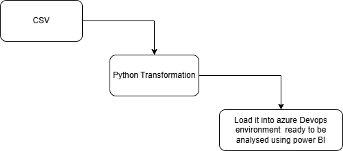

# M5-20260106

Marina has cought up!

Architecture Diagram

User Story: Library Stakeholder Data Quality Insights
As a library operations manager,
I want to receive automated, reliable reports on our collection and circulation data quality,
So that I can make informed decisions about resource allocation, identify trends in patron behavior, and ensure our catalog accuracy without depending on manual data checks.
Acceptance Criteria:
I receive weekly automated dashboard reports showing data quality metrics (e.g., percentage of complete records, duplicate entries identified, data freshness)
The system flags critical issues such as missing ISBN numbers, incorrect publication dates, or patron records with incomplete contact information
I can access historical trend data showing how our data quality has improved over time
Reports highlight actionable insights like: which collection areas have the most data gaps, peak times for data errors, or catalog entries requiring review
The dashboard is accessible via a web interface with visualizations that non-technical staff can understand
I can export reports in PDF or Excel format for board meetings and stakeholder presentations
Alerts are sent immediately for critical data quality issues that could impact library operations
Business Value:
Better collection management decisions based on accurate data
Improved patron experience through reliable catalog information
Resource optimization by identifying areas needing attention
Increased confidence in reporting to library board and funders
Priority: High
Story Points: 5
